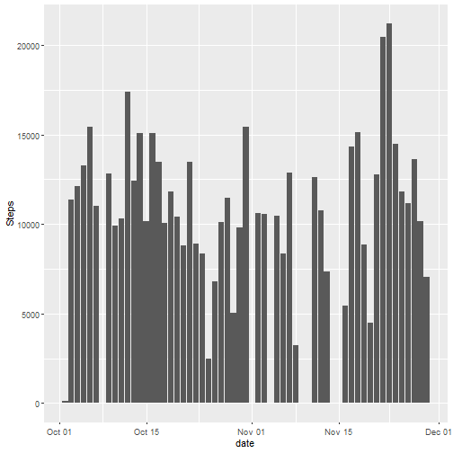
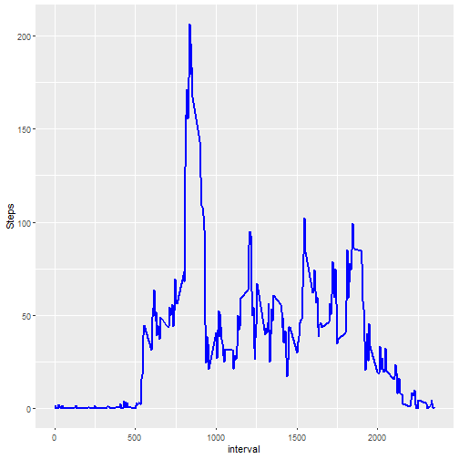
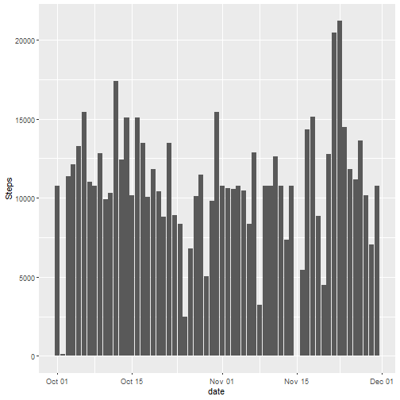
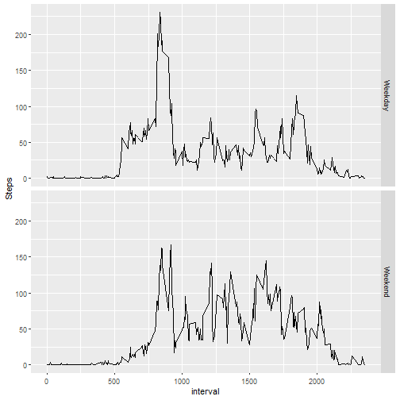

## Loading and preprocessing the data


```r
##Loading data
data <- read.csv(file = "~/R Working Directory/repdata_data_activity/activity.csv")

##Dealing with Date variable
data$date <- as.POSIXct(data$date, format = "%Y-%m-%d")
```

## Histogram of the total number of steps taken each day

### Creating a new dataset called n_steps


```r
library(dplyr)
n_steps <- summarize(group_by(.data = data , date) , Steps = sum(steps))
n_steps
```

```
## # A tibble: 61 × 2
##    date                Steps
##    <dttm>              <int>
##  1 2012-10-01 00:00:00    NA
##  2 2012-10-02 00:00:00   126
##  3 2012-10-03 00:00:00 11352
##  4 2012-10-04 00:00:00 12116
##  5 2012-10-05 00:00:00 13294
##  6 2012-10-06 00:00:00 15420
##  7 2012-10-07 00:00:00 11015
##  8 2012-10-08 00:00:00    NA
##  9 2012-10-09 00:00:00 12811
## 10 2012-10-10 00:00:00  9900
## # ℹ 51 more rows
```

### Histogram


```r
library(ggplot2)
g <- ggplot(n_steps , aes(x = date , y = Steps))
g+geom_col()
```



## Mean and median number of steps taken each day


```r
Mean <- mean(n_steps$Steps , na.rm = TRUE)
Median <- median(n_steps$Steps , na.rm = TRUE)
cat("Mean = " , Mean , "\n")
```

```
## Mean =  10766.19
```

```r
cat("Median = " , Median)
```

```
## Median =  10765
```

## Time series plot of the average number of steps taken

### Creating a new dataset called avg_steps


```r
avg_steps <- summarize(group_by(.data = data , interval) , Steps = mean(steps , na.rm = TRUE))
avg_steps
```

```
## # A tibble: 288 × 2
##    interval  Steps
##       <int>  <dbl>
##  1        0 1.72  
##  2        5 0.340 
##  3       10 0.132 
##  4       15 0.151 
##  5       20 0.0755
##  6       25 2.09  
##  7       30 0.528 
##  8       35 0.868 
##  9       40 0     
## 10       45 1.47  
## # ℹ 278 more rows
```

### Time Series Plot


```r
g <- ggplot(avg_steps , aes(x = interval , y = Steps))
g+geom_line(size = 1 , col = "blue")
```



## The 5-minute interval that, on average, contains the maximum number of steps


```r
filter(avg_steps , avg_steps$Steps == max(avg_steps$Steps))
```

```
## # A tibble: 1 × 2
##   interval Steps
##      <int> <dbl>
## 1      835  206.
```

## Missing values

### total number of missing values in the dataset


```r
sum(is.na(data))
```

```
## [1] 2304
```

### Using average interval for imputing missing data


```r
data_imputed <- data
for (i in 1:17568) {
  if (is.na(data_imputed$steps[i]))  {
    interval <- data_imputed$interval[i]
    data_imputed$steps[i] <- avg_steps$Steps[avg_steps$interval == interval]
  }
}
```

### Histogram after imputing


```r
n_steps <- summarize(group_by(.data = data_imputed , date) , Steps = sum(steps))
g <- ggplot(n_steps , aes(x = date , y = Steps))
g+geom_col()
```



## Panel plot for weekdays and weekends

### Adding a factor variable to the dataset


```r
data_imputed$day <- ""
for (i in 1:17568) {
  if (weekdays(data_imputed$date[i]) == "Saturday" | weekdays(data_imputed$date[i]) == "Sunday" ) {
    data_imputed$day[i] <- "Weekend"}
  else{
    data_imputed$day[i] <- "Weekday" 
  }
}
data_imputed$day <- factor(x = data_imputed$day)
data_imputed
```

```
##           steps       date interval     day
## 1     1.7169811 2012-10-01        0 Weekday
## 2     0.3396226 2012-10-01        5 Weekday
## 3     0.1320755 2012-10-01       10 Weekday
## 4     0.1509434 2012-10-01       15 Weekday
## 5     0.0754717 2012-10-01       20 Weekday
## 6     2.0943396 2012-10-01       25 Weekday
## 7     0.5283019 2012-10-01       30 Weekday
## 8     0.8679245 2012-10-01       35 Weekday
## 9     0.0000000 2012-10-01       40 Weekday
## 10    1.4716981 2012-10-01       45 Weekday
## 11    0.3018868 2012-10-01       50 Weekday
## 12    0.1320755 2012-10-01       55 Weekday
## 13    0.3207547 2012-10-01      100 Weekday
## 14    0.6792453 2012-10-01      105 Weekday
## 15    0.1509434 2012-10-01      110 Weekday
## 16    0.3396226 2012-10-01      115 Weekday
## 17    0.0000000 2012-10-01      120 Weekday
## 18    1.1132075 2012-10-01      125 Weekday
## 19    1.8301887 2012-10-01      130 Weekday
## 20    0.1698113 2012-10-01      135 Weekday
## 21    0.1698113 2012-10-01      140 Weekday
## 22    0.3773585 2012-10-01      145 Weekday
## 23    0.2641509 2012-10-01      150 Weekday
## 24    0.0000000 2012-10-01      155 Weekday
## 25    0.0000000 2012-10-01      200 Weekday
## 26    0.0000000 2012-10-01      205 Weekday
## 27    1.1320755 2012-10-01      210 Weekday
## 28    0.0000000 2012-10-01      215 Weekday
## 29    0.0000000 2012-10-01      220 Weekday
## 30    0.1320755 2012-10-01      225 Weekday
## 31    0.0000000 2012-10-01      230 Weekday
## 32    0.2264151 2012-10-01      235 Weekday
## 33    0.0000000 2012-10-01      240 Weekday
## 34    0.0000000 2012-10-01      245 Weekday
## 35    1.5471698 2012-10-01      250 Weekday
## 36    0.9433962 2012-10-01      255 Weekday
## 37    0.0000000 2012-10-01      300 Weekday
## 38    0.0000000 2012-10-01      305 Weekday
## 39    0.0000000 2012-10-01      310 Weekday
## 40    0.0000000 2012-10-01      315 Weekday
## 41    0.2075472 2012-10-01      320 Weekday
## 42    0.6226415 2012-10-01      325 Weekday
## 43    1.6226415 2012-10-01      330 Weekday
## 44    0.5849057 2012-10-01      335 Weekday
## 45    0.4905660 2012-10-01      340 Weekday
## 46    0.0754717 2012-10-01      345 Weekday
## 47    0.0000000 2012-10-01      350 Weekday
## 48    0.0000000 2012-10-01      355 Weekday
## 49    1.1886792 2012-10-01      400 Weekday
## 50    0.9433962 2012-10-01      405 Weekday
## 51    2.5660377 2012-10-01      410 Weekday
## 52    0.0000000 2012-10-01      415 Weekday
## 53    0.3396226 2012-10-01      420 Weekday
## 54    0.3584906 2012-10-01      425 Weekday
## 55    4.1132075 2012-10-01      430 Weekday
## 56    0.6603774 2012-10-01      435 Weekday
## 57    3.4905660 2012-10-01      440 Weekday
## 58    0.8301887 2012-10-01      445 Weekday
## 59    3.1132075 2012-10-01      450 Weekday
## 60    1.1132075 2012-10-01      455 Weekday
## 61    0.0000000 2012-10-01      500 Weekday
## 62    1.5660377 2012-10-01      505 Weekday
## 63    3.0000000 2012-10-01      510 Weekday
## 64    2.2452830 2012-10-01      515 Weekday
## 65    3.3207547 2012-10-01      520 Weekday
## 66    2.9622642 2012-10-01      525 Weekday
## 67    2.0943396 2012-10-01      530 Weekday
## 68    6.0566038 2012-10-01      535 Weekday
## 69   16.0188679 2012-10-01      540 Weekday
## 70   18.3396226 2012-10-01      545 Weekday
## 71   39.4528302 2012-10-01      550 Weekday
## 72   44.4905660 2012-10-01      555 Weekday
## 73   31.4905660 2012-10-01      600 Weekday
## 74   49.2641509 2012-10-01      605 Weekday
## 75   53.7735849 2012-10-01      610 Weekday
## 76   63.4528302 2012-10-01      615 Weekday
## 77   49.9622642 2012-10-01      620 Weekday
## 78   47.0754717 2012-10-01      625 Weekday
## 79   52.1509434 2012-10-01      630 Weekday
## 80   39.3396226 2012-10-01      635 Weekday
## 81   44.0188679 2012-10-01      640 Weekday
## 82   44.1698113 2012-10-01      645 Weekday
## 83   37.3584906 2012-10-01      650 Weekday
## 84   49.0377358 2012-10-01      655 Weekday
## 85   43.8113208 2012-10-01      700 Weekday
## 86   44.3773585 2012-10-01      705 Weekday
## 87   50.5094340 2012-10-01      710 Weekday
## 88   54.5094340 2012-10-01      715 Weekday
## 89   49.9245283 2012-10-01      720 Weekday
## 90   50.9811321 2012-10-01      725 Weekday
## 91   55.6792453 2012-10-01      730 Weekday
## 92   44.3207547 2012-10-01      735 Weekday
## 93   52.2641509 2012-10-01      740 Weekday
## 94   69.5471698 2012-10-01      745 Weekday
## 95   57.8490566 2012-10-01      750 Weekday
## 96   56.1509434 2012-10-01      755 Weekday
## 97   73.3773585 2012-10-01      800 Weekday
## 98   68.2075472 2012-10-01      805 Weekday
## 99  129.4339623 2012-10-01      810 Weekday
## 100 157.5283019 2012-10-01      815 Weekday
## 101 171.1509434 2012-10-01      820 Weekday
## 102 155.3962264 2012-10-01      825 Weekday
## 103 177.3018868 2012-10-01      830 Weekday
## 104 206.1698113 2012-10-01      835 Weekday
## 105 195.9245283 2012-10-01      840 Weekday
## 106 179.5660377 2012-10-01      845 Weekday
## 107 183.3962264 2012-10-01      850 Weekday
## 108 167.0188679 2012-10-01      855 Weekday
## 109 143.4528302 2012-10-01      900 Weekday
## 110 124.0377358 2012-10-01      905 Weekday
## 111 109.1132075 2012-10-01      910 Weekday
## 112 108.1132075 2012-10-01      915 Weekday
## 113 103.7169811 2012-10-01      920 Weekday
## 114  95.9622642 2012-10-01      925 Weekday
## 115  66.2075472 2012-10-01      930 Weekday
## 116  45.2264151 2012-10-01      935 Weekday
## 117  24.7924528 2012-10-01      940 Weekday
## 118  38.7547170 2012-10-01      945 Weekday
## 119  34.9811321 2012-10-01      950 Weekday
## 120  21.0566038 2012-10-01      955 Weekday
## 121  40.5660377 2012-10-01     1000 Weekday
## 122  26.9811321 2012-10-01     1005 Weekday
## 123  42.4150943 2012-10-01     1010 Weekday
## 124  52.6603774 2012-10-01     1015 Weekday
## 125  38.9245283 2012-10-01     1020 Weekday
## 126  50.7924528 2012-10-01     1025 Weekday
## 127  44.2830189 2012-10-01     1030 Weekday
## 128  37.4150943 2012-10-01     1035 Weekday
## 129  34.6981132 2012-10-01     1040 Weekday
## 130  28.3396226 2012-10-01     1045 Weekday
## 131  25.0943396 2012-10-01     1050 Weekday
## 132  31.9433962 2012-10-01     1055 Weekday
## 133  31.3584906 2012-10-01     1100 Weekday
## 134  29.6792453 2012-10-01     1105 Weekday
## 135  21.3207547 2012-10-01     1110 Weekday
## 136  25.5471698 2012-10-01     1115 Weekday
## 137  28.3773585 2012-10-01     1120 Weekday
## 138  26.4716981 2012-10-01     1125 Weekday
## 139  33.4339623 2012-10-01     1130 Weekday
## 140  49.9811321 2012-10-01     1135 Weekday
## 141  42.0377358 2012-10-01     1140 Weekday
## 142  44.6037736 2012-10-01     1145 Weekday
## 143  46.0377358 2012-10-01     1150 Weekday
## 144  59.1886792 2012-10-01     1155 Weekday
## 145  63.8679245 2012-10-01     1200 Weekday
## 146  87.6981132 2012-10-01     1205 Weekday
## 147  94.8490566 2012-10-01     1210 Weekday
## 148  92.7735849 2012-10-01     1215 Weekday
## 149  63.3962264 2012-10-01     1220 Weekday
## 150  50.1698113 2012-10-01     1225 Weekday
## 151  54.4716981 2012-10-01     1230 Weekday
## 152  32.4150943 2012-10-01     1235 Weekday
## 153  26.5283019 2012-10-01     1240 Weekday
## 154  37.7358491 2012-10-01     1245 Weekday
## 155  45.0566038 2012-10-01     1250 Weekday
## 156  67.2830189 2012-10-01     1255 Weekday
## 157  42.3396226 2012-10-01     1300 Weekday
## 158  39.8867925 2012-10-01     1305 Weekday
## 159  43.2641509 2012-10-01     1310 Weekday
## 160  40.9811321 2012-10-01     1315 Weekday
## 161  46.2452830 2012-10-01     1320 Weekday
## 162  56.4339623 2012-10-01     1325 Weekday
## 163  42.7547170 2012-10-01     1330 Weekday
## 164  25.1320755 2012-10-01     1335 Weekday
## 165  39.9622642 2012-10-01     1340 Weekday
## 166  53.5471698 2012-10-01     1345 Weekday
## 167  47.3207547 2012-10-01     1350 Weekday
## 168  60.8113208 2012-10-01     1355 Weekday
## 169  55.7547170 2012-10-01     1400 Weekday
## 170  51.9622642 2012-10-01     1405 Weekday
## 171  43.5849057 2012-10-01     1410 Weekday
## 172  48.6981132 2012-10-01     1415 Weekday
## 173  35.4716981 2012-10-01     1420 Weekday
## 174  37.5471698 2012-10-01     1425 Weekday
## 175  41.8490566 2012-10-01     1430 Weekday
## 176  27.5094340 2012-10-01     1435 Weekday
## 177  17.1132075 2012-10-01     1440 Weekday
## 178  26.0754717 2012-10-01     1445 Weekday
## 179  43.6226415 2012-10-01     1450 Weekday
## 180  43.7735849 2012-10-01     1455 Weekday
## 181  30.0188679 2012-10-01     1500 Weekday
## 182  36.0754717 2012-10-01     1505 Weekday
## 183  35.4905660 2012-10-01     1510 Weekday
## 184  38.8490566 2012-10-01     1515 Weekday
## 185  45.9622642 2012-10-01     1520 Weekday
## 186  47.7547170 2012-10-01     1525 Weekday
## 187  48.1320755 2012-10-01     1530 Weekday
## 188  65.3207547 2012-10-01     1535 Weekday
## 189  82.9056604 2012-10-01     1540 Weekday
## 190  98.6603774 2012-10-01     1545 Weekday
## 191 102.1132075 2012-10-01     1550 Weekday
## 192  83.9622642 2012-10-01     1555 Weekday
## 193  62.1320755 2012-10-01     1600 Weekday
## 194  64.1320755 2012-10-01     1605 Weekday
## 195  74.5471698 2012-10-01     1610 Weekday
## 196  63.1698113 2012-10-01     1615 Weekday
## 197  56.9056604 2012-10-01     1620 Weekday
## 198  59.7735849 2012-10-01     1625 Weekday
## 199  43.8679245 2012-10-01     1630 Weekday
## 200  38.5660377 2012-10-01     1635 Weekday
## 201  44.6603774 2012-10-01     1640 Weekday
## 202  45.4528302 2012-10-01     1645 Weekday
## 203  46.2075472 2012-10-01     1650 Weekday
## 204  43.6792453 2012-10-01     1655 Weekday
## 205  46.6226415 2012-10-01     1700 Weekday
## 206  56.3018868 2012-10-01     1705 Weekday
## 207  50.7169811 2012-10-01     1710 Weekday
## 208  61.2264151 2012-10-01     1715 Weekday
## 209  72.7169811 2012-10-01     1720 Weekday
## 210  78.9433962 2012-10-01     1725 Weekday
## 211  68.9433962 2012-10-01     1730 Weekday
## 212  59.6603774 2012-10-01     1735 Weekday
## 213  75.0943396 2012-10-01     1740 Weekday
## 214  56.5094340 2012-10-01     1745 Weekday
## 215  34.7735849 2012-10-01     1750 Weekday
## 216  37.4528302 2012-10-01     1755 Weekday
## 217  40.6792453 2012-10-01     1800 Weekday
## 218  58.0188679 2012-10-01     1805 Weekday
## 219  74.6981132 2012-10-01     1810 Weekday
## 220  85.3207547 2012-10-01     1815 Weekday
## 221  59.2641509 2012-10-01     1820 Weekday
## 222  67.7735849 2012-10-01     1825 Weekday
## 223  77.6981132 2012-10-01     1830 Weekday
## 224  74.2452830 2012-10-01     1835 Weekday
## 225  85.3396226 2012-10-01     1840 Weekday
## 226  99.4528302 2012-10-01     1845 Weekday
## 227  86.5849057 2012-10-01     1850 Weekday
## 228  85.6037736 2012-10-01     1855 Weekday
## 229  84.8679245 2012-10-01     1900 Weekday
## 230  77.8301887 2012-10-01     1905 Weekday
## 231  58.0377358 2012-10-01     1910 Weekday
## 232  53.3584906 2012-10-01     1915 Weekday
## 233  36.3207547 2012-10-01     1920 Weekday
## 234  20.7169811 2012-10-01     1925 Weekday
## 235  27.3962264 2012-10-01     1930 Weekday
## 236  40.0188679 2012-10-01     1935 Weekday
## 237  30.2075472 2012-10-01     1940 Weekday
## 238  25.5471698 2012-10-01     1945 Weekday
## 239  45.6603774 2012-10-01     1950 Weekday
## 240  33.5283019 2012-10-01     1955 Weekday
## 241  19.6226415 2012-10-01     2000 Weekday
## 242  19.0188679 2012-10-01     2005 Weekday
## 243  19.3396226 2012-10-01     2010 Weekday
## 244  33.3396226 2012-10-01     2015 Weekday
## 245  26.8113208 2012-10-01     2020 Weekday
## 246  21.1698113 2012-10-01     2025 Weekday
## 247  27.3018868 2012-10-01     2030 Weekday
## 248  21.3396226 2012-10-01     2035 Weekday
## 249  19.5471698 2012-10-01     2040 Weekday
## 250  21.3207547 2012-10-01     2045 Weekday
##  [ reached 'max' / getOption("max.print") -- omitted 17318 rows ]
```

### Creating a new dataset called avg_steps


```r
avg_steps <- summarize(group_by(.data = data_imputed , interval , day ) , Steps = mean(steps))
avg_steps
```

```
## # A tibble: 576 × 3
## # Groups:   interval [288]
##    interval day       Steps
##       <int> <fct>     <dbl>
##  1        0 Weekday 2.25   
##  2        0 Weekend 0.215  
##  3        5 Weekday 0.445  
##  4        5 Weekend 0.0425 
##  5       10 Weekday 0.173  
##  6       10 Weekend 0.0165 
##  7       15 Weekday 0.198  
##  8       15 Weekend 0.0189 
##  9       20 Weekday 0.0990 
## 10       20 Weekend 0.00943
## # ℹ 566 more rows
```

### Panel plot


```r
g <- ggplot(data = avg_steps , aes(interval , Steps)) + geom_line()
g+ facet_grid(rows = vars(day))
```


